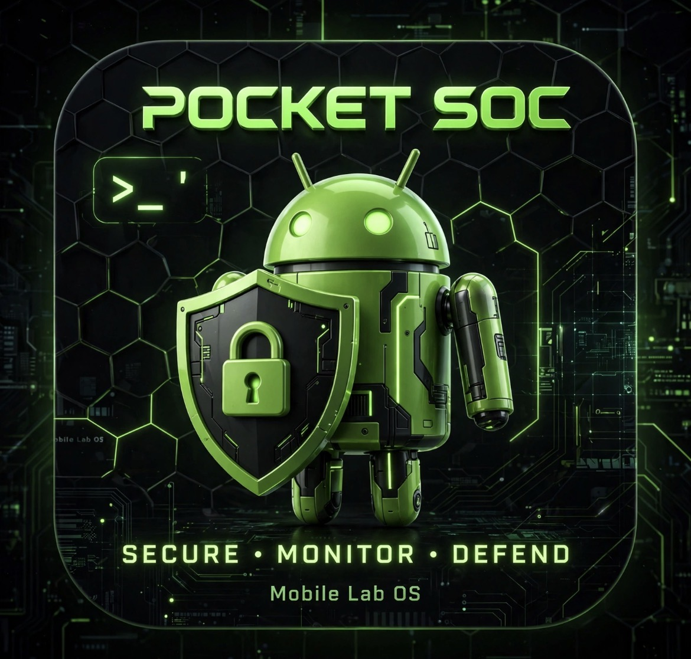
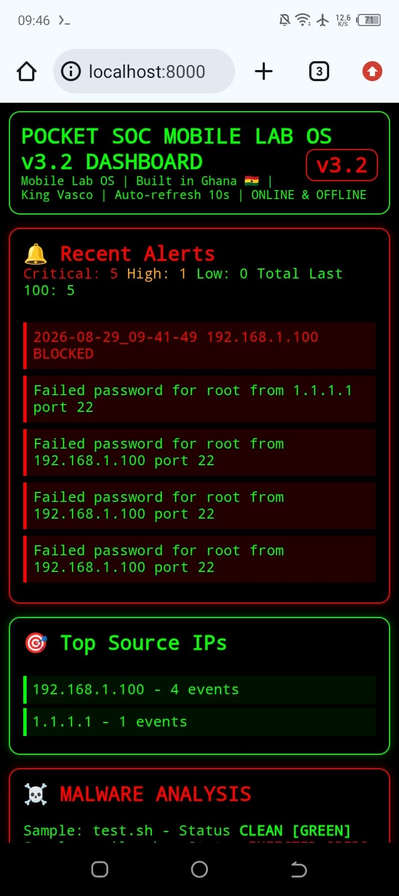
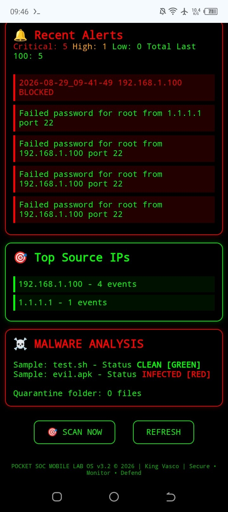
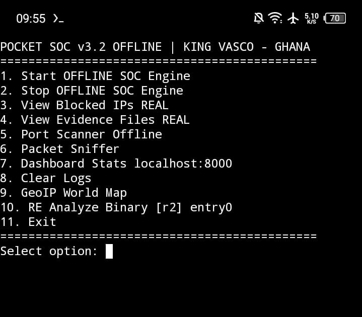
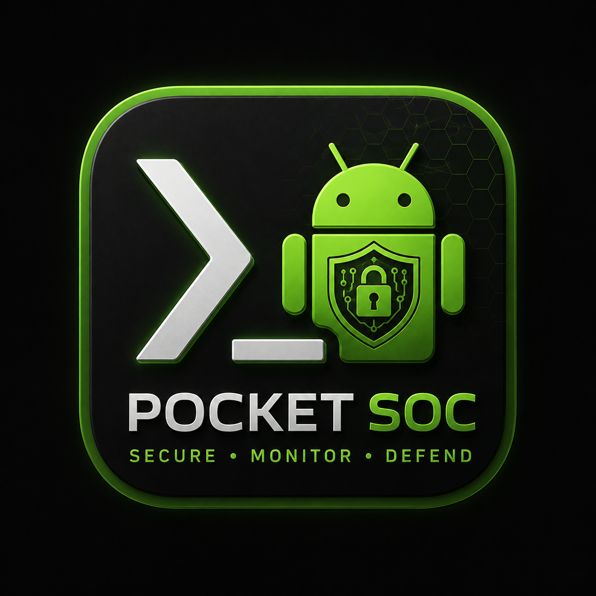

# POCKET SOC MOBILE V3.2 👑
SOC Dashboard + GeoIP World Map running on Termux Android
Built in Ghana GH by King Vasco

 

## Features

POCKET SOC v3.2 100% OFFLINE MODE
Built in Ghana GH - Accra - King Vasco

1. Start OFFLINE SOC Engine
2. Stop OFFLINE SOC Engine
3. View Blocked IPs REAL
4. View Evidence Files REAL
5. Port Scanner Offline + Online (8.8.8.8 / 127.0.0.1)
6. Dashboard Stats localhost:8080
7. View Blocked IPs
8. Clear Logs
9. GeoIP World Map
10. Exit

Pocket SOC Mobile Lab OS is a 9-module cybersecurity toolkit designed for African SMEs priced out of $20k SOC tools. 

Runs 100% offline on Android.
5 Modules: Network Scan | Log Analysis | Detection Engine | Dashboard | Automation

Built around D.I.D.A.R: Detect → Investigate → Document → Automate → Reduce

## Run
git clone https://github.com/vascoray/pocketsoc.git
cd pocketsoc
pip install fastapi uvicorn -q
chmod +x *.py
python3 auto_block.py &
python3 live_server.py &
echo "Open: http://localhost:8080 and http://localhost:3003"
